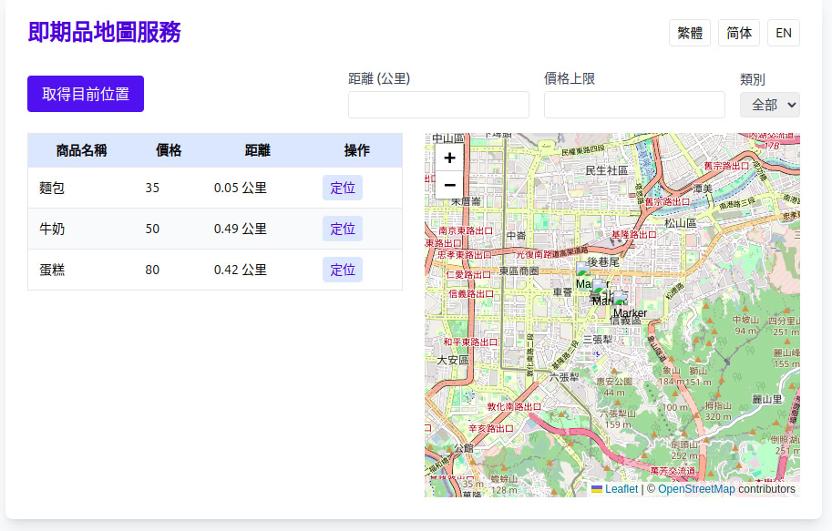

# 即期品動態地圖服務

## 專案目標
打造一個跨平台（Web/iOS/Android）即時顯示即期品資訊的地圖服務，協助用戶快速找到附近的即期品，並支援多語系與多條件過濾。

## 主要功能
- 即時 GPS 定位搜尋
- 類 Tasteme「最近上架」推薦排序
- 整合全家友善時光地圖庫存（API 或模擬資料）
- 多語系支援（繁中/簡中/英文）
- 每 5 分鐘自動更新地點資訊，確保 99.9% 成功率
- 多種地圖檢視模式（地圖、列表、清單）
- 多條件過濾（距離、價格、類別）
- 響應式設計與高效能
- 模組化元件架構

## 技術架構
- 前端：React（Web）、React Native（iOS/Android）、地圖元件（Google Maps/Mapbox/Leaflet）
- 後端：Node.js/Express 或 Python/FastAPI
- 資料庫：MongoDB 或 PostgreSQL（可用模擬資料）
- 多語系：i18n（react-i18next 或類似方案）
- 定時任務：Node-cron、Celery 或伺服器排程

## 開發與測試
- 支援模擬資料開發與測試
- 跨平台測試（Web/iOS/Android）
- 多語系測試
- 單元與整合測試

## 即將調整重點
- 任務分工與模組劃分
- API 與資料結構設計
- 推薦排序與庫存更新演算法
- 多語系與 UI/UX 細節

## 如何在本地端運行

### 1. 啟動後端（API 伺服器）
```bash
cd backend
npm install
node index.js
```
預設後端 API 會在 http://localhost:3001 提供服務。

### 2. 啟動前端（Web 前端）
```bash
cd frontend
npm install
npm install web-vitals
npm start
```
啟動後瀏覽器會自動開啟 http://localhost:3000



### 3. 功能驗證
- 地圖會顯示台北市預設位置
- 點擊「取得目前位置」可顯示你的 GPS 定位
- 商品列表與過濾功能可即時互動
- 可依需求擴充 API 串接與多語系

## 移動版（Expo Go）API 連線設定

1. 請在 `expiring-products-mobile/.env` 檔案設定 API_URL，例如：
   ```
   API_URL=http://192.168.1.100:3001
   ```
   其中 `192.168.1.100` 請改為你電腦的區網 IP。
2. 手機與電腦需在同一 Wi-Fi 下，並確保 3001 port 沒有被防火牆擋住。
3. Expo Go App 會自動讀取 .env 設定，從區網 API 取得資料。
4. 若需公開測試，可用 ngrok 或雲端主機將 API 暴露為公開網址。

---

> 請確認上述說明，若有需求或建議請提出。 